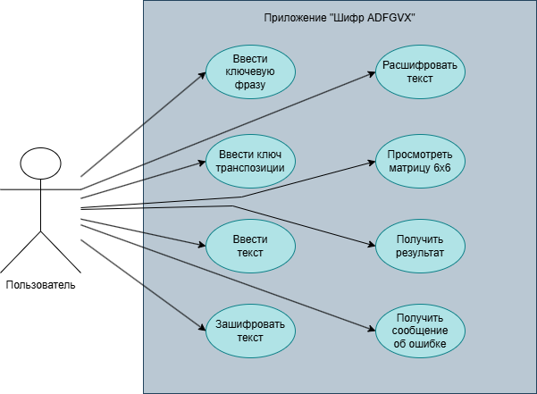
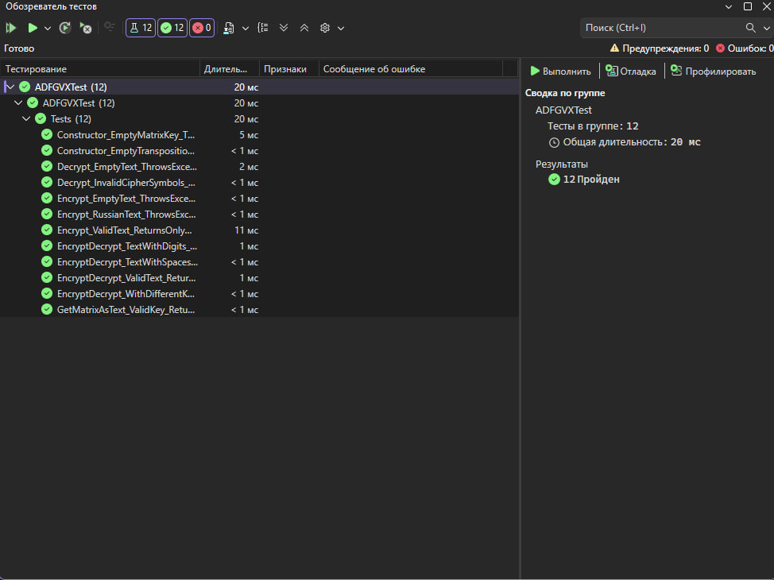

# Практическая работа №7  
## Отладка программы различными способами. Часть 2

## Информация о проекте

**Название проекта:** PR7-ADFGVX  
**Тема:** Разработка и тестирование приложения для шифрования и дешифрования информации  
**Вариант:** 6  
**Алгоритм:** Шифр ADFGVX  
**Метод:** полиалфавитный шифр с матрицей 6x6 и перестановкой  
**Среда разработки:** Microsoft Visual Studio  
**Язык программирования:** C#  
**Тип приложения:** графическое приложение Windows Forms  

## Разработчик

**ФИО:** Морозов А.В.  
**Группа:** 223 

## Цель работы

Цель практической работы — произвести процедуру отладки программного обеспечения встроенными средствами среды программирования Microsoft Visual Studio, а также выполнить автоматизированное и ручное тестирование разработанного приложения.

## Описание предметной области

В данной работе реализуется приложение для шифрования и дешифрования информации с помощью шифра ADFGVX.

Шифр ADFGVX является шифром, который использует матрицу 6x6 и перестановку по ключу. Матрица содержит латинские буквы A-Z и цифры 0-9. Для обозначения координат в матрице используются символы A, D, F, G, V, X.

Алгоритм состоит из двух основных этапов:

1. **Подстановка** — каждый символ исходного текста заменяется парой символов ADFGVX в соответствии с его координатами в матрице 6x6.
2. **Транспозиция** — полученная после подстановки строка переставляется по ключу транспозиции.

Для дешифрования выполняются обратные действия: сначала обратная транспозиция, затем обратная подстановка.

## Требования к приложению

### Функциональные требования

- приложение должно генерировать матрицу 6x6 на основе ключевой фразы;
- приложение должно выполнять шифрование текста;
- приложение должно выполнять дешифрование текста;
- приложение должно использовать двухэтапное шифрование: подстановку и транспозицию;
- приложение должно принимать ключ транспозиции;
- приложение должно отображать результат работы;
- приложение должно отображать сгенерированную матрицу;
- приложение должно проверять пустой ввод;
- приложение должно обрабатывать недопустимые символы.

### Нефункциональные требования

- приложение должно иметь графический интерфейс;
- интерфейс должен содержать поля для ключевой фразы, ключа транспозиции и текста;
- интерфейс должен содержать кнопки шифрования и дешифрования;
- приложение должно отображать всплывающие сообщения при ошибках;
- код должен быть документирован XML-комментариями;
- приложение должно быть протестировано автоматизированными и ручными тестами.

## Диаграмма вариантов использования

## Тестовые сценарии

| ID | Название теста | Тип теста | Входные данные | Ожидаемый результат | Фактический результат | Статус |
|---|---|---|---|---|---|---|
| TC-01 | Полный цикл шифрования и дешифрования | Позитивный | SECRET, CARGO, HELLO2026 | После дешифрования получается HELLO2026 | Получено HELLO2026 | Пройден |
| TC-02 | Проверка символов шифртекста | Позитивный | SECRET, CARGO, HELLO2026 | Результат содержит только A, D, F, G, V, X | Результат содержит только допустимые символы | Пройден |
| TC-03 | Работа с другими ключами | Позитивный | MATRIX, TRAIN, TEST123 | После дешифрования получается TEST123 | Получено TEST123 | Пройден |
| TC-04 | Обработка пробелов | Позитивный | HELLO 2026 | После дешифрования получается HELLO2026 | Получено HELLO2026 | Пройден |
| TC-05 | Шифрование текста с цифрами | Позитивный | CODE12345 | После дешифрования получается CODE12345 | Получено CODE12345 | Пройден |
| TC-06 | Пустой текст для шифрования | Негативный | пустая строка | Сообщение об ошибке | Получено сообщение об ошибке | Пройден |
| TC-07 | Пустой текст для дешифрования | Негативный | пустая строка | Сообщение об ошибке | Получено сообщение об ошибке | Пройден |
| TC-08 | Пустой ключ матрицы | Негативный | пустой matrixKey | Сообщение об ошибке | Получено сообщение об ошибке | Пройден |
| TC-09 | Пустой ключ транспозиции | Негативный | пустой transpositionKey | Сообщение об ошибке | Получено сообщение об ошибке | Пройден |
| TC-10 | Русские буквы в тексте | Негативный | ПРИВЕТ | Сообщение о недопустимых символах | Получено сообщение об ошибке | Пройден |
| TC-11 | Недопустимые символы в шифртексте | Негативный | ABC123 | Сообщение о недопустимых символах | Получено сообщение об ошибке | Пройден |
| TC-12 | Проверка генерации матрицы | Позитивный | SECRET | Матрица содержит буквы и цифры | Матрица сгенерирована | Пройден |
| TC-13 | Проверка графического интерфейса | Нефункциональный | Запуск приложения | Форма открывается корректно | Форма открылась | Пройден |
| TC-14 | Проверка сообщения об ошибке в интерфейсе | Нефункциональный | русский текст | Отображается всплывающее сообщение | Сообщение отображается | Пройден |

## Автоматизированное тестирование

Для проверки функциональных требований были разработаны автоматизированные тесты на языке C# с использованием NUnit.

Проверялись следующие ситуации:

- полный цикл шифрования и дешифрования;
- работа с разными ключами;
- генерация матрицы 6x6;
- корректность символов зашифрованного текста;
- обработка пробелов;
- обработка цифр;
- обработка пустого ввода;
- обработка пустых ключей;
- обработка недопустимых символов;
- валидация зашифрованного текста.

### Скриншот окна «Обозреватель тестов»

## Использованные средства отладки Microsoft Visual Studio

В ходе выполнения работы были использованы следующие средства отладки:

- точки останова;
- пошаговое выполнение программы;
- Step Over;
- Step Into;
- Continue;
- просмотр значений переменных;
- окно Locals;
- окно Watch;
- анализ исключений;
- анализ вывода приложения;
- перезапуск приложения в режиме отладки.

## Журнал ручного тестирования

| ID | Проверка | Действие | Ожидаемый результат | Фактический результат | Статус |
|---|---|---|---|---|---|
| MT-01 | Запуск приложения | Запустить приложение | Открывается главная форма | Главная форма открылась | Пройден |
| MT-02 | Проверка элементов интерфейса | Осмотреть форму | Отображаются поля ключей, текста, результата, матрицы и кнопки | Все элементы отображаются | Пройден |
| MT-03 | Шифрование текста | Ввести SECRET, CARGO, HELLO2026 и нажать «Зашифровать» | Появляется шифртекст из символов ADFGVX | Шифртекст появился | Пройден |
| MT-04 | Дешифрование текста | Ввести полученный шифртекст и нажать «Расшифровать» | Появляется HELLO2026 | Получено HELLO2026 | Пройден |
| MT-05 | Проверка отображения матрицы | Выполнить шифрование | Отображается матрица 6x6 | Матрица отображается | Пройден |
| MT-06 | Проверка пустого ввода | Оставить поле текста пустым и нажать кнопку | Появляется сообщение об ошибке | Сообщение появилось | Пройден |
| MT-07 | Проверка недопустимых символов | Ввести ПРИВЕТ и нажать «Зашифровать» | Появляется сообщение об ошибке | Сообщение появилось | Пройден |
| MT-08 | Проверка пустого ключа | Оставить поле ключа пустым | Появляется сообщение об ошибке | Сообщение появилось | Пройден |

## Баг-репорт

| ID | Описание бага | Шаги воспроизведения | Ожидаемый результат | Фактический результат | Статус |
|---|---|---|---|---|---|
| BUG-01 | Несовпадение имён элементов интерфейса и кода | Запустить сборку проекта после создания интерфейса | Проект собирается без ошибок | Возникали ошибки о несуществующих элементах TextBox и Button | Исправлено |
| BUG-02 | Ошибка обработчика label_Click | Случайно создать обработчик события Label | Проект собирается без ошибок | Visual Studio требовала метод label_Click | Исправлено |
| BUG-03 | Некорректная обработка недопустимых символов | Ввести русский текст | Пользователь видит сообщение об ошибке | Добавлена обработка исключения и MessageBox | Исправлено |

## Исправление багов

В ходе работы были исправлены следующие проблемы:

- элементы интерфейса были переименованы в соответствии с кодом;
- добавлены обработчики нажатия кнопок шифрования и дешифрования;
- добавлена обработка исключительных ситуаций;
- добавлены сообщения об ошибках через `MessageBox`;
- реализована валидация пустого ввода;
- реализована проверка допустимых символов для исходного и зашифрованного текста.

## Вывод

В ходе выполнения практической работы было разработано графическое приложение для шифрования и дешифрования информации с помощью шифра ADFGVX.

В приложении реализованы генерация матрицы 6x6 на основе ключевой фразы, этап подстановки и этап транспозиции по ключу. Для проверки корректности работы программы были разработаны автоматизированные тесты и проведено ручное тестирование.

Также были использованы встроенные средства отладки Microsoft Visual Studio: точки останова, пошаговое выполнение, просмотр переменных, окно Watch и окно Locals. В процессе тестирования были выявлены и исправлены ошибки, после чего приложение успешно прошло повторную проверку.

Практическая работа позволила закрепить навыки разработки, отладки и тестирования программного обеспечения.
